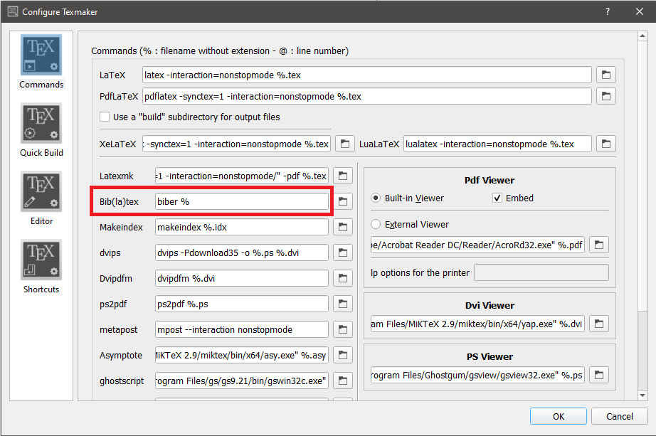

# A (Xe)LaTeX Report Template

A (Xe)Latex report template based on my
[thesis template](https://github.com/adamoshen/thesis-template). Tested with `Texmaker` on Windows.

## Tips and notes

- Ensure that your `main.tex` includes `\usepackage{CU-report}`
- Modify the `CU-thesis.sty` file to your liking

This report uses the `biblatex` package for citations, whereas the `thesis-template` used `natbib`.
The `biblatex` package is used for including multiple bibliographies at the end of each chapter. The
default backend of `biblatex` is `biber`, whereas `natbib` used `BibTeX`.

In addition, `Texmaker` uses `BibTeX` by default for bibliography related things. Therefore, a
custom build command should be created, which includes temporarily (or permanently) swapping out
`BibTeX` for `biber`, creating the build command, and then optionally reverting back to `Texmaker`'s
default setting.

1. In `Texmaker`, go to `Options` &rightarrow; `Configure Texmaker`.

2. In the Bib(la)tex field, replace `bibtex %` with `biber %`, then click OK.  

3. Next, go to `User` &rightarrow; `User Commands` &rightarrow; `Edit User Commands`.

4. Create a new build command using the wizard with the following compile order:  
`XeLaTeX` &rightarrow; `BibTeX` &rightarrow; `XeLaTeX` &rightarrow; `XeLaTeX` &rightarrow; `View PDF`.

5. (Optional) Repeat steps 1 and 2 to revert `biber %` to `bibtex %`.
